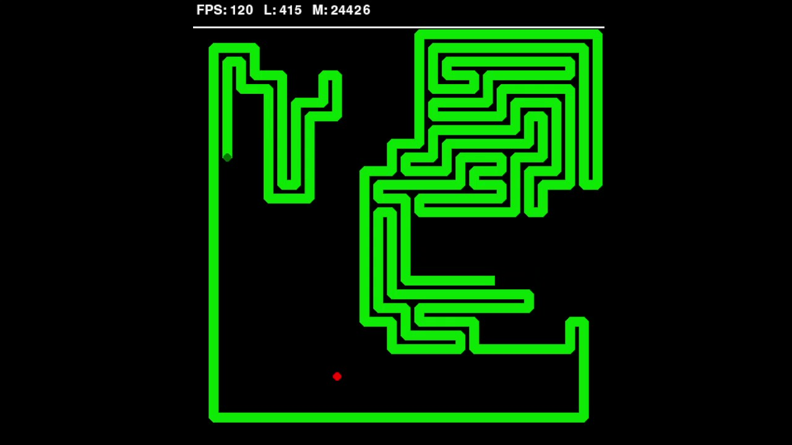
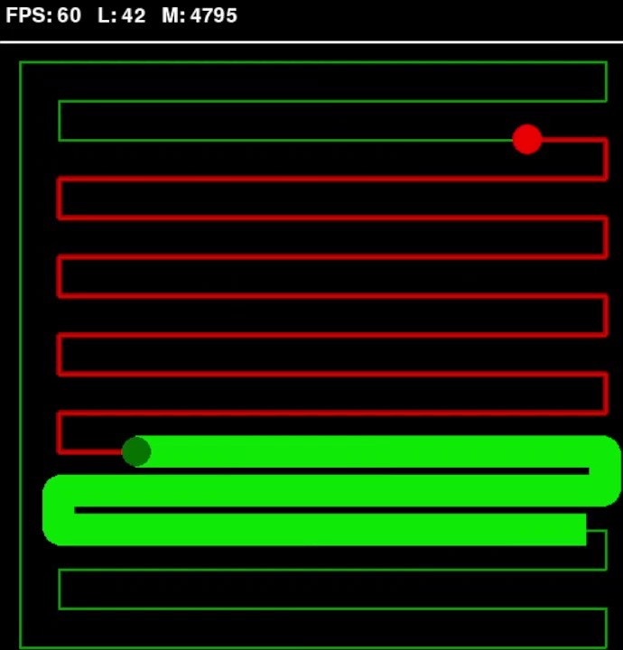
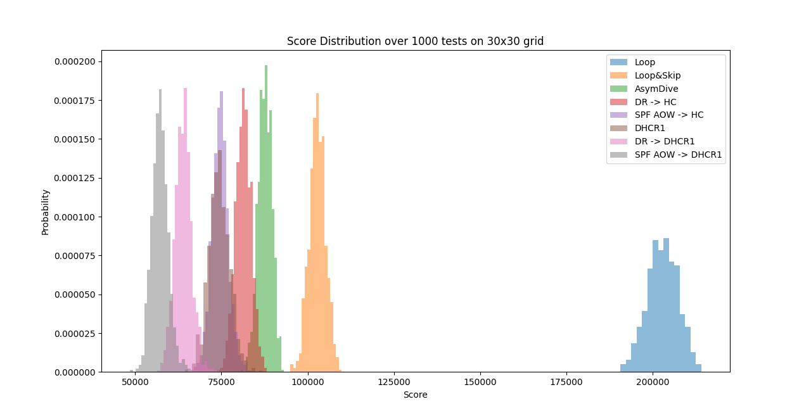
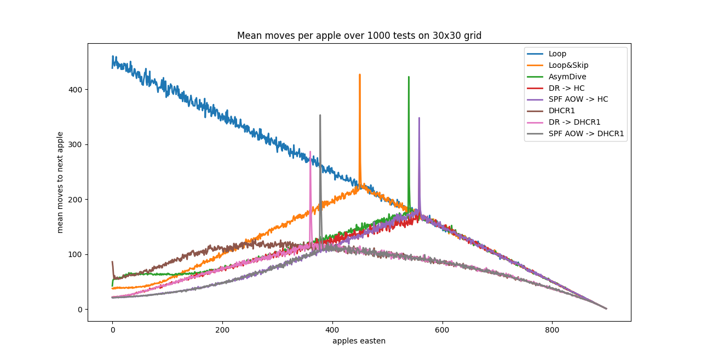

# Overview

This repository hosts a number of strategies for playing the arcade game Snake, as well as some scripts to test, compare and animate them. Here is a recording of our best solver yet:

<a href="Visuals/Videos/30x30_best_solver.mp4">

</a>

# Motivation

The simplest strategy to solve snake on a grid of some large area $A$ is to strictly follow a Hamiltonian cycle . We refer to this method as Loop, and below is a recording of a game. (Note: Hamiltonian cycles only exist when $A$ is even, but there is a modification of Loop for odd $A$ which obeys the properties listed.)

<a href="Visuals/Videos/16x16_Loop.mp4">

</a>

Loop has some interesting properties:

- Safety: Wins every game, no matter where the apples or (length 1) snake spawn.

- Efficiency: The moves for the entire game can be calculated in $\mathcal{O}(A^2)$ time.

- The average number of moves required to complete the game is given by $\displaystyle\mu \sim \frac{1}{4}A^2$.

We ask the question: if we require solvers to obey the safety and efficiency conditions above, how performant can they be? That is, if we ask that they win every possible game, can compute the entire game roughly as fast as Loop can, how few moves do they need to beat the average game? Can they beat the $\frac{1}{4}A^2$ average moves of Loop?

We know we cannot beat $\Omega(A^{3/2})$, and in fact we don't think we can beat $\mathcal{O}(A^2)$, but we can significantly improve the constant. It turns out, we can compete with even the best known algorithms under these constraints!

# Strategy Comparison

Recordings of some solvers can be found [here](Visuals/Videos). Below is a comparison of several solvers we have implemented, which can be reproduced using [CompareGridSolvers](CompareGridSolvers.py).

```
Comparing methods on 30x30 grid over 1000 games:
Method                      Mean    Std Dev  Time (s)
Loop                  203014.176   4467.284    59.195
Loop&Skip             102839.921   2362.774    61.585
AsymDive               87620.680   1987.503    65.114
DR -> HC               81400.631   2269.119    58.070
SPF AOW -> HC          74589.907   2424.039   199.031
DHCR1                  74394.365   3066.036   164.585
DR -> DHCR1            63965.304   2445.242    87.985
SPF AOW -> DHCR1       57239.570   2391.349   194.460
```

<a href="Visuals/ScoreGraphs/Figure_1.png">

</a>

<a href="Visuals/ScoreGraphs/Figure_2.png">

</a>

For reference, Brian Haidet's Dynamic Hamiltonian Cycle Repair (the most famous snake solver) achieves a mean score of about 58,000 moves on the 30x30 grid, but takes a couple of minutes to play a single game! Our current best algorithm contains a phase heavily inspired by DHCR so is temporarily called DHCR1, and it is way more efficient, completing 1000 games in the same time.

Notice that many strategies seem have linear pieces in their "mean moves per apple" plot. Some of this lines can be justified heuristically (proving is difficult for such a complex game) to approximate the mean.

| Method    | Also Known As                | $\mu_L$    | $\mu$         |
| --------- | ---------------------------- | ---------- | ------------- |
| Loop      | Hamiltonian Cycle            | $(A-L)/2$  | $A^2/4$       |
| Loop&Skip | Pertubated Hamiltonian Cycle | $L/2$      | $A^2/8$       |
| AsymDive  | None - created by Samsam     | $L/3$      | $A^2/10$      |
| DR        | Drone's Rules                | $\leq L/3$ | $\leq A^2/10$ |

Also the spikes in the above graph are the snake spending (negligibly many)) moves to re-orient itself as it switches from one method to another.

# Other Resources

### Snake-playing strategies

- John Tapsell – [Pertubated Hamiltonian Cycle](https://johnflux.com/2015/05/02/nokia-6110-part-3-algorithms/)

- Brian Haidet - [Dynamic Hamiltonian Cycle Repair](<https://github.com/BrianHaidet/AlphaPhoenix/tree/master/Snake_AI_(2020a)_DHCR_with_strategy>)

- AlphaPhoenix - [Playlist of snake solvers](https://www.youtube.com/playlist?list=PL39PMIJeIAqxtM91O9fSHTYQR4ezOwGD_)

- Twan van Laarhoven - [Cell](https://github.com/twanvl/snake/)

### Relevant research

- Graafsma, Manthey, Skopalik (2025) - [_Playing Snake on a Graph_](https://arxiv.org/abs/2506.21281)

  A mathematical study of graphs on which the snake has a winning strategy. Proves that this question is NP-hard even for vertex-induced subgraphs of the rectangular grid graph.

- Böhl, Ellmauthaler, Gaggl (2024) - [_Winning Snake: Design Choices in Multi-Shot ASP_](https://arxiv.org/abs/2408.08150)

  Seems a brute-force version of Dynamic Hamiltonian Cycle Repair. If so, this should win every game, but takes over an hour to run a game on a 16x16 grid. Has some moves-per-apple graphs.

### ML approaches

Unfortunately, most other resources are machine-learning oriented, which just happen to train an agent to play Snake. Such agents often get into situations where the snake is trapped, and/or are so computationally expensive that they only work on small grids. Though watching a well-trained agent play can help form a heuristic about what 'good play' looks like, so I'll leave a few links.

- CodeBullet - [A.I. Learns to play Snake using Deep Q Learning](https://www.youtube.com/watch?v=-NJ9frfAWRo) (and other videos)

- TwoPoint Code - [How I Made the Best AI Snake](https://www.youtube.com/watch?v=lqpApkkqtAs)

- Du, Gemp, Wu, Wu (2022) - [_AlphaSnake: Policy Iteration on a Nondeterministic NP-hard Markov Decision Process_](https://arxiv.org/abs/2211.09622)
